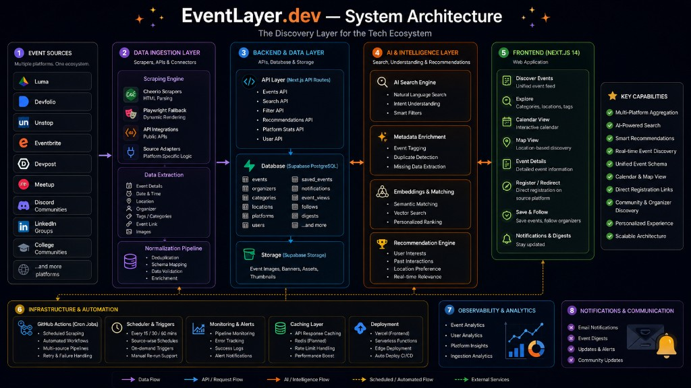

# EventLayer.dev by Rudra Malvankar

**The discovery layer for the tech ecosystem.**

One place to find hackathons, meetups, workshops, and conferences — aggregated from Luma, Devfolio, Unstop, Meetup, Eventbrite, and more — with AI-powered search, maps, and a personalized feed.

**Live demo:** [eventlayer-dev.vercel.app](https://eventlayer-dev.vercel.app)

---

## About this project

EventLayer started as a personal build: I was tired of checking five different platforms every week and still missing events in my city. This repo is the full-stack app behind [EventLayer.dev](https://eventlayer-dev.vercel.app) — scrapers, normalization, Supabase, Gemini search, and the Next.js UI.

I'm documenting it here at a personal level as the project grows (portfolio, open source, and coursework).

### Author

**Rudra Malvankar**  
- GitHub: *https://github.com/RudraMalvankar*
- LinkedIn: *https://www.linkedin.com/in/rudra-malvankar/*  


### Education & credentials

| Credential | Status |
|------------|--------|
| MIT *(course / certificate name)* | *Coming soon — link will be added here* |
| UMIT *(or other)* | *Optional* |

> I'll update this section with certificate links and badges as they're issued.

---

## System architecture

High-level flow: **event sources → ingestion & normalization → Supabase → AI layer → Next.js frontend**, with GitHub Actions / cron for scheduled sync and Vercel for deployment.



| Layer | What it does |
|-------|----------------|
| **Event sources** | Luma, Devfolio, Unstop, Devpost, Meetup, Eventbrite, and community listings |
| **Data ingestion** | Cheerio + Playwright scrapers, platform adapters, dedup & schema mapping |
| **Backend** | Next.js API routes, Supabase PostgreSQL, storage for banners |
| **AI & intelligence** | Gemini natural-language search, metadata enrichment, personalized ranking |
| **Frontend** | Unified feed, explore, calendar, map, save & follow, digest |
| **Ops** | Admin sync, caching, Vercel Analytics & Speed Insights |

---

## Acknowledgments

Huge thanks to collaborators who helped shape the data layer:

- **[Sweta Prasad (@shwetap3000)](https://github.com/shwetap3000)** — helped with **scraping and API integration for [Unstop](https://unstop.com)** and **[Devpost](https://devpost.com)**. Her work on those source adapters made multi-platform aggregation much more reliable.

If you contributed and aren't listed, open an issue or PR — happy to credit you.

---

## Features

- **Unified event feed** — normalized events from multiple platforms in one place  
- **AI search** — natural-language queries (e.g. *"free AI hackathons in Mumbai this weekend"*) via Gemini  
- **Map & calendar** — discover by location and date  
- **Save events** — Supabase Auth + per-user saved list  
- **Communities & follows** — follow organizers and communities; personalized `/feed`  
- **Weekly digest** — AI-generated summary for logged-in users  
- **Admin dashboard** — trigger platform sync, monitor ingestion  
- **Email subscribe** — optional Resend-powered list for community updates  

---

## Tech stack

| Area | Tools |
|------|--------|
| Frontend | Next.js 14 (App Router), React 18, Tailwind CSS |
| Backend | Next.js API Routes |
| Database & auth | Supabase (PostgreSQL + Auth + RLS) |
| AI | Google Gemini (`GEMINI_API_KEY`) |
| Scraping | Cheerio, Playwright (fallback), platform-specific services |
| Maps | Leaflet + react-leaflet |
| Hosting | [Vercel](https://vercel.com) |
| Analytics | Vercel Analytics, Speed Insights |

---

## Quick start

### 1. Clone and install

```bash
git clone <your-repo-url>
cd EventLayer
npm install
```

### 2. Environment

Copy `.env.example` to `.env.local` and fill in values:

```bash
cp .env.example .env.local
```

**Required**

```env
NEXT_PUBLIC_SUPABASE_URL=
NEXT_PUBLIC_SUPABASE_ANON_KEY=
SUPABASE_SERVICE_KEY=
NEXT_PUBLIC_SITE_URL=http://localhost:3000
GEMINI_API_KEY=
SCRAPE_SECRET=
ENRICH_WITH_GEMINI=true
ADMIN_EMAILS=your@email.com
```

**Optional**

```env
RESEND_API_KEY=
RESEND_FROM=EventLayer <onboarding@yourdomain.com>
ADMIN_SESSION_SECRET=
SUPABASE_DB_PASSWORD=
```

### 3. Database setup

Apply Supabase schema from `supabase/`, then:

```bash
npm run db:extensions
npm run db:admin
npm run db:email
```

### 4. Run locally

```bash
npm run dev
```

Open [http://localhost:3000](http://localhost:3000).

### 5. Production build

```bash
npm run build
npm run start
```

---

## Scripts

| Command | Description |
|---------|-------------|
| `npm run dev` | Development server (port 3000) |
| `npm run build` | Production build |
| `npm run start` | Start production server |
| `npm run lint` | ESLint |
| `npm run clean` | Remove `.next` cache |
| `npm run smoke` | Playwright smoke tests |
| `npm run e2e:signup` | Signup + profile API check |
| `npm run db:extensions` | Apply schema extensions |
| `npm run db:admin` | Seed admin user |
| `npm run db:email` | Apply email subscription schema |
| `npm run start:cron` | Local scraper cron (optional) |

---

## API overview

| Method | Route | Description |
|--------|-------|-------------|
| `GET` | `/api/events` | List / filter events |
| `GET` | `/api/events/[id]` | Event detail |
| `POST` | `/api/search` | AI natural-language search |
| `GET` | `/api/trending` | Trending events |
| `GET` | `/api/feed` | Personalized feed (auth) |
| `GET` / `POST` | `/api/digest` | Weekly digest (auth) |
| `GET` / `POST` | `/api/saved` | Saved events (auth) |
| `POST` | `/api/scrape/[platform]` | Trigger scrape (secret) |
| `POST` | `/api/admin/sync` | Admin multi-platform sync |

Responses use `{ data, error }`.

---

## Event data model

Normalized fields: `title`, `description`, `platform`, `city`, `country`, `mode`, `category`, `tags`, `banner_url`, `event_url`, `start_date`, `end_date`, `organizer`, `is_free`.

Supported platforms include: `luma`, `meetup`, `devfolio`, `unstop`, `devpost`, `eventbrite`.

---

## Deployment (Vercel)

### Manual deployment
1. Import the repo on Vercel.  
2. Set the same env vars as `.env.example` (use `NEXT_PUBLIC_SITE_URL` = your production URL).  
3. In **Supabase → Authentication → URL configuration**, add your production URL and `http://localhost:3000/**` to redirect allowlist.  
4. Schedule scraping via admin sync, GitHub Actions, or `npm run start:cron` on a worker.

### CI/CD with GitHub Actions
This repo includes automated Vercel deployment via GitHub Actions.

**Required secrets** (set in GitHub repo Settings → Secrets and variables → Actions):
- `VERCEL_TOKEN` — Vercel API token
- `VERCEL_ORG_ID` — Your Vercel organization/team ID
- `VERCEL_PROJECT_ID` — Vercel project ID

**Workflow**: `.github/workflows/vercel-deploy.yml`
- Triggers on push/PR to `main`
- Runs lint + build
- Deploys to Vercel production
- Comments preview URL on PRs

---

## Security

- Write routes require a valid Supabase session (or admin cookie for `/admin`).  
- `SUPABASE_SERVICE_KEY` is server-only.  
- Scraper output is sanitized before insert.  
- RLS enabled on user-owned tables (e.g. `saved_events`).  

---

## Troubleshooting

| Issue | Fix |
|-------|-----|
| Scraping fails | Check `SCRAPE_SECRET` and platform-specific env flags |
| AI search fails | Verify `GEMINI_API_KEY` and quota |
| Auth redirects to localhost | Set `NEXT_PUBLIC_SITE_URL` and Supabase redirect URLs |
| Stale build / login loop | `npm run clean` then `npm run dev` |
| Signup rate limit in E2E | Use `E2E_SIGNIN_EMAIL` / `E2E_SIGNIN_PASSWORD` for an existing test user |

---

## License

*(Add MIT or your chosen license — e.g. `LICENSE` file)*

---

## Roadmap

- [ ] Add MIT certificate link & badge  
- [ ] Expand Devpost / Unstop coverage and monitoring  
- [ ] Scheduled email digests (Resend + cron)  
- [ ] Vector / semantic search (embeddings)  
- [ ] Redis caching layer (as in architecture diagram)

---

<p align="center">
  Built with care for builders who don't want to miss the next hackathon.<br/>
  <a href="https://eventlayer-dev.vercel.app">eventlayer-dev.vercel.app</a>
</p>
